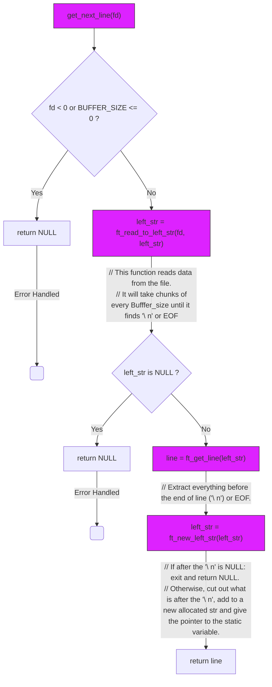

# Documentation for `GNL`

## 1. Pseudo
``` c
int main(void){
   char        *line;       // Variable to store the extracted line
    static char *left_str;  // Static variable to store leftover data
```

``` c
// Read data into left_str 
	// Example: "This is a line and this is the end but buffer is big \n. And this is also here,"
	
	// left_str size is intial=BUFFER_SIZE
	// every new read, is a new ft_join where the new left_size will have its size reallocated (A better implementation would be to start left_str_size with a given large size and double it every time it checks its full!)
		// If the chunk of file read is without \n or not EOF keep reading in chunks of buffer size
			//while (!ft_strchr(left_str, '\n') && rd_bytes != 0)
		
    left_str = ft_read_to_left_str(fd, left_str); 
```

``` c
// Extract the line from left_str 
	// we need to extract everything before the end of line(\n)(the first) or EOF. This will be give to return
    line = ft_get_line(left_str);
```

``` c
// Update left_str for next call 
	// If after the \n is NULL: exit return NUll, otherwise we need to cut out what is after the \n and add to a new allocated str and give the pointer to the static variable.
    left_str = ft_new_left_str(left_str);  
```

```c
// Return the extracted line. 
	// And wait for the next call, where the beginig of the next line is already inside of the static variable and the read funciton stored the  pointer location of the last read.
return (line);
}
```


## 2. Src Commented
### 1. Libft_.a
``` C

#include "get_next_line.h"

// Calculates the length of a string up to a specific character or the null terminator.
size_t	ft_strlen(char *s, int c)
{
	size_t	i;  // Index for traversing the string

	i = 0;      // Initialize index to 0
	if (!s)    // Check if the string is NULL
		return (0); // Return 0 if the string is NULL
	while (s[i] && s[i] != c) // Loop until the character 'c' or the null terminator is found
		i++;      // Increment the index
	return (i); // Return the length of the string up to 'c' or the null terminator
}

// Finds the first occurrence of a character in a string.
char	*ft_strchr(char *s, int c)
{
	int	i;  // Index for traversing the string// Loop counter
    int     fd1;            // File descriptor for the first file

	i = 0;      // Initialize index to 0
	if (!s)    // Check if the string is NULL
		return (0); // Return NULL if the string is NULL
	if (c == '\0')  // Check if the character is the null terminator
		return ((char *)&s[ft_strlen(s, '\0')]); // Return a pointer to the null terminator
	while (s[i])  // Loop until the end of the string
	{
		if (s[i] == (char) c) // Check if the current character matches 'c'
			return ((char *)&s[i]); // Return a pointer to the character
		i++;      // Increment the index
	}
	return (0);   // Return NULL if the character is not found
}

// Concatenates two strings, up to a specific character in the second string.
char	*ft_strjoin(char *left_str, char *buff, int c)
{
	size_t	i;    // Index for traversing the first string
	size_t	j;    // Index for traversing the second string
	char	*str;   // Pointer to store the concatenated string

	if (!left_str)  // Check if the first string is NULL
	{
		left_str = (char *)malloc(1 * sizeof(char)); // Allocate memory for an empty string
		left_str[0] = '\0';  // Add the null terminator
	}
	if (!left_str || !buff) // Check if either string is NULL
		return (NULL);       // Return NULL if either string is NULL
	str = (char *) malloc(sizeof(char) * ((ft_strlen(left_str, '\0')
					+ ft_strlen(buff, c)) + 2)); // Allocate memory for the concatenated string (+2 for 'c' and '\0')
	if (str == NULL)    // Check if memory allocation was successful
		return (NULL);     // Return NULL if allocation failed
	i = -1;            // Initialize index for the first string to -1
	j = 0;            // Initialize index for the second string to 0
	if (left_str)      // Check if the first string is not NULL
		while (left_str[++i]) // Loop through the first string
			str[i] = left_str[i]; // Copy characters from the first string to the new string
	while (buff[j] && buff[j] != c) // Loop through the second string up to character 'c'
		str[i++] = buff[j++];   // Copy characters from the second string to the new string
	if (buff[j] == c)    // Check if the current character in buff is 'c'
		str[i++] = c;      // Copy the character 'c' to the new string
	return (str[i] = '\0', free(left_str), str); // Add null terminator, free the first string, and return the new string
}
```
### 2. GNL_func
``` c

// Creates a new string containing the remaining data after extracting a line.
char	*ft_new_left_str(char *left_str)
{
	int		i;          // Index for traversing the string
	int		j;          // Index for the new string
	char	*str;         // Pointer to store the new string

	i = 0;              // Initialize index to 0
	i = ft_strlen(left_str, '\n'); // Find the length of the line (up to '\n')
	if (!left_str[i])    // Check if the end of the line is reached
	{
		free(left_str);  // Free the original string
		return (NULL);     // Return NULL as there is no remaining data
	}
	str = (char *)malloc(sizeof(char) * (ft_strlen(left_str, '\0') - i + 1)); // Allocate memory for the new string (+1 for \0)
	if (!str)            // Check if memory allocation was successful
		return (NULL);     // Return NULL if allocation failed
	i++;                  // Move index past the newline character
	j = 0;              // Initialize index for the new string
	while (left_str[i])    // Loop through the remaining characters
		str[j++] = left_str[i++]; // Copy characters to the new string
	return (str[j] = '\0', free(left_str), str); // Add null terminator, free old string, and return new string
}

// Extracts a line from the given string.
char	*ft_get_line(char *left_str)
{
	char	*str;         // Pointer to store the extracted line

	if (!*left_str)      // Check if the string is empty
		return (NULL);     // Return NULL if the string is empty
	str = ft_strjoin(NULL, left_str, '\n'); // Extract the line up to '\n'
	return (str);         // Return the extracted line
}

// Reads from a file descriptor and stores the data in a string.
char	*ft_read_to_left_str(int fd, char *left_str)
{
	char	*buff;         // Buffer to store data read from the file
	int		rd_bytes;      // Variable to store the number of bytes read

	buff = (char *) malloc((BUFFER_SIZE + 1) * sizeof(char)); // Allocate memory for the buffer (+1 for \0)
	if (!buff)            // Check if memory allocation was successful
		return (NULL);     // Return NULL if allocation failed
	rd_bytes = 1;          // Initialize rd_bytes to 1 to enter the loop
	while (!ft_strchr(left_str, '\n') && rd_bytes != 0) // Loop until newline or EOF
	{
		rd_bytes = read(fd, buff, BUFFER_SIZE); // Read from file into buffer
		if (rd_bytes == -1)  // Check if read() was successful
		{
			free(buff);    // Free the buffer if read() failed
			free(left_str); // Free the left_str if read() failed
			return (NULL);   // Return NULL to indicate an error
		}
		buff[rd_bytes] = '\0'; // Add null terminator to the buffer
		left_str = ft_strjoin(left_str, buff, '\0'); // Concatenate buffer to left_str
	}
	free(buff);          // Free the buffer
	return (left_str);     // Return the updated left_str
}
```
### 3. GNL_Main.c
``` C
#include "get_next_line.h" // Include the header file for function prototypes
#include <unistd.h>         // Include for read() function

// Function to get the next line from a file descriptor
char    *get_next_line(int fd)
{
    char        *line;       // Variable to store the extracted line
    static char *left
    _str;  // Static variable to store leftover data

    if (fd < 0 || BUFFER_SIZE <= 0) // Check for invalid file descriptor or buffer size
        return (0);                 // Return 0 (NULL) if invalid
    left_str = ft_read_to_left_str(fd, left_str); // Read data into left_str | example: "This is a line and this is the end\n but buffer is big and this is also here, could also contain here the second line\n"
    if (!left_str)        // Check if ft_read_to_left_str() was successful
        return (NULL);     // Return NULL if it failed
    line = ft_get_line(left_str); // Extract the line from left_str | we need to extract everything beofore the end of line(\n)(the first) or EOF. This will be give to return
    left_str = ft_new_left_str(left_str); // Update left_str for next call | If after the \n is NULL: exit return NUll, otherwise we need to cut out what is after the \n and add to a new allocated str and give the pointer to the static variable. 
    return (line);         // Return the extracted line. And wait for the next call, where the beginig of the next line is already inside of the static variable and the read funciton stored the  pointer location of the last read.
}
```



### 4. Usage_main.c
``` c
// Example main function to test get_next_line()
#include <stdio.h>
#include <fcntl.h>
int main(void)
{
    char    *line;         // Variable to store the line read by get_next_line()
    int     i;              // Loop counter
    int     fd1;            // File descriptor for the first file
    int     fd2;            // File descriptor for the second file
    int     fd3;            // File descriptor for the third file

    fd1 = open("../../4.Tester/test.txt", O_RDONLY);     // Open the first file
    fd2 = open("../../4.Tester/test1.txt", O_RDONLY);    // Open the second file
    fd3 = open("../../4.Tester/corrupted_file.txt", O_RDONLY); // Open the third file

    i = 1;                  // Initialize loop counter
    printf("##############FRIST FILE\n"); // Print a header for the first file
    while ((line = get_next_line(fd1))) // Read lines from the first file
    {
        printf("line [%02d]: %s", i, line); // Print the line number and the line
        free(line);        // Free the memory allocated for the line
        i++;              // Increment the loop counter
    }
    i = 0;                  // Reset loop counter
    printf("\n##############SECOND FILE\n"); // Print a header for the second file
    while ((line = get_next_line(fd2))) // Read lines from the second file
    {
        printf("line [%02d]: %s", i, line); // Print the line number and the line
        free(line);        // Free the memory allocated for the line
        i++;              // Increment the loop counter
    }
    i = 0;                  // Reset loop counter
    printf("\n##############THIRD FILE\n"); // Print a header for the third file
    while ((line = get_next_line(fd3))) // Read lines from the third file
    {
        printf("line [%02d]: %s", i, line); // Print the line number and the line
        free(line);        // Free the memory allocated for the line
        i++;              // Increment the loop counter
    }
    close(fd1);           // Close the first file
    close(fd2);           // Close the second file
    close(fd3);           // Close the third file
    return (0);             // Return 0 to indicate successful execution
}

```
## 3. Undefined Behaviors and Edge Cases
**Undefined Behaviors**
* **File Modification:** If the file pointed to by the file descriptor is modified while `get_next_line` is reading from it, the behavior is undefined. This means you need to handle the possibility of the file's content changing between calls to `read`.
* **Binary Files:** Reading from a binary file with `get_next_line` is undefined behavior. While the instructions say you can implement a logical way to handle this, it implies that the standard `get_next_line` logic might not work as expected with binary data.

**Edge Cases**
* **Variable BUFFER_SIZE:**  The instructions explicitly state that your code should work with different `BUFFER_SIZE` values, including very large values (e.g., 9999, 10000000) and very small values (e.g., 1).
* **Reading from Standard Input:** Your function should work correctly when reading from standard input (file descriptor 0), which might have different characteristics than reading from a regular file.
* **Empty Lines:** The file might contain empty lines, which should be handled correctly.
* **Lines without Newlines:** The last line of the file might not end with a newline character (`\n`). Your function should still be able to read this line.
* **Very Long Lines:**  Lines in the file could be very long, potentially exceeding the `BUFFER_SIZE`. Your function should be able to handle this by reading the line in multiple chunks.
* **Error Handling:** You should handle potential errors from `read`, `malloc`, and other functions gracefully.

**How to handle these**
* **File Modification:** You might need to use system calls like `fstat` to check if the file has been modified since the last read.
* **Binary Files:** You might need to add special logic to handle binary data, potentially by not relying on the newline character as the line separator.
* **Variable `BUFFER_SIZE`:**  Ensure your code uses dynamic memory allocation and doesn't make assumptions about the `BUFFER_SIZE`.
* **Standard Input:** Test your code specifically with standard input to ensure it works as expected.
* **Empty Lines and Lines without Newlines:**  Make sure your logic for extracting lines and updating the `left_str` handles these cases correctly.
* **Very Long Lines:** Use a loop and `realloc` as needed to handle lines that exceed the `BUFFER_SIZE`.
* **Error Handling:**  Always check the return values of functions like `read`, `malloc`, and `free` and handle errors appropriately (e.g., by returning `NULL` or printing an error message).

