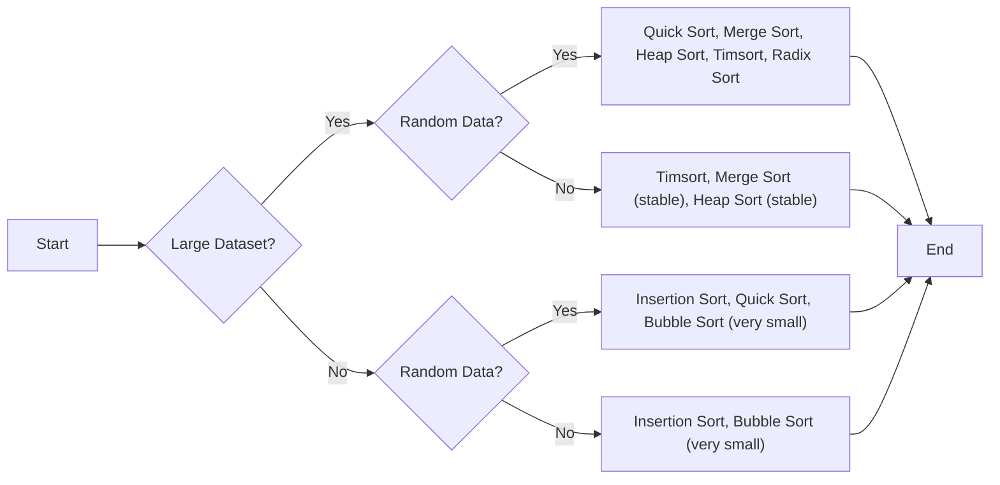

# Push_swap
---

## 1. Todo
- Lima ideas
	- Circular linekd list and double directions (augmented linkd list)
	- Push swap commands
	- Quick sort push swap 
	- Turk algo
## 2. Resources
- test how to do your algo https://github.com/stevebalk/push-swap-clicker

- [Tutotrial](https://medium.com/nerd-for-tech/push-swap-tutorial-fa746e6aba1e)
- [Tutorial 2](https://github.com/42YerevanProjects/push_swap)

## 3. >> KeyNotes
### > Algos
#### Intro
---
- **Binary Trees**
	- Binary Search Tree *(great for searching and sorting because of their ordered structure)*
	- Max Heap *(are excellent for priority queues and heapsort because they provide quick access to the minimum or maximum element)*
	- General Bin Tree *(random)*
	
- **Small Data**
	- Simple Implementation and Nearly sorted data
		- Insertion Sort (most simple, cards sorting)
		- Bubble Sort (for very small datasets and simplicity)
	- Effective 
		- Selection (most efficient in worst case)
- **Large Data**
	- Binary tree strategies(divide and conquer)
		- Quick (BST tree, bottom up approach, bad at worst case )
		- Merge (BST tree, bottom up approach, stable )
		- Heapsort (max(or min) heapfy proccess, stable)
		- Introsort (hybrid:quick(bad pivot choice->)+heapfy)
	- Hash tables 
		- Bucket (by ranges)
		- Radix (by decimals)
- Others
		- Tim (merge+insertion)
		- Turk Algo
###### Big O (time&space complexity)
> computation usage

|                                     | Algorithm                  | Best Case  | Worst Case | Space Complexity | Constant Factor | Better at                                       |
| :---------------------------------- | :------------------------- | :--------- | :--------- | :--------------- | :-------------- | :---------------------------------------------- |
| **Small Data Sets**                 |                            |            |            |                  |                 |                                                 |
|                                     | Shell Sort                 | O(n log n) | O(n^2)     | O(1)             | 5 - 20          | simple, a generalization of insertion sort.     |
|                                     | Insertion Sort             | O(n)       | O(n^2)     | O(1)             | 1 - 5           | Very efficient for small or nearly sorted data. |
| Nearly Sorted / Fast Implementation |                            |            |            |                  |                 |                                                 |
|                                     | Bubble Sort                | O(n)       | O(n^2)     | O(1)             | 1 - 5           | Simple                                          |
|                                     | Selection Sort             | O(n^2)     | O(n^2)     | O(1)             | 2 - 10          | one line code                                   |
| **Large Data Sets**                 |                            |            |            |                  |                 |                                                 |
| BST                                 | Introsort (quick+heapsort) | O(n log n) | O(n log n) | O(n log n)       | 3-10            | notStable, BST                                  |
|                                     | Heap Sort                  | O(n log n) | O(n log n) | O(1)             | 5 - 30          | Stable, BST, max/min heap                       |
|                                     | Merge Sort                 | O(n log n) | O(n log n) | O(n)             | 5 - 50          | Stable, BST<br>                                 |
| Best at best case scenario          | Quick Sort                 | O(n log n) | O(n^2)     | O(log n)         | 2 - 20          | notStable, Better at best case scenario,        |
|                                     | Radix Sort (binary)        | O(nk)      | O(nk)      | O(n)             | 5 - 20          | Large data sets, but Small bits (small digits)  |
|                                     | Radix Sort (base 10)       | O(nk)      | O(nk)      | O(n)             | 10 - 50         | Large data sets, but Small number digits        |
| **Others**                          |                            |            |            |                  |                 |                                                 |
|                                     | Timsort (merge+insertion)  | O(n)       | O(n log n) | O(n)             | 2 - 10          | Very efficient for small or nearly sorted data. |
|                                     | Turk Algo                  |            |            |                  |                 |                                                 |




#### HeapSort
Let's visualize Heapsort with a concrete example!

**1. The Unsorted Array:**

We'll start with our familiar unsorted array:

```
[7, 3, 1, 8, 5, 2, 4, 6]
```

**2. Building the Heap:**

Heapsort uses a special data structure called a "binary heap." Think of it like a binary tree with some specific rules:

- **Complete Binary Tree:** Every level is full except possibly the last, which is filled from left to right.
- **Max Heap Property:** The value of each node is greater than or equal to the value of its children.

Let's visualize our array as a binary heap:

```
       7
     /   \
    3     1
   / \   /
  8   5 2  4 
 /
6 
```

This isn't a valid max heap yet, because the max heap property is violated in many places (e.g., 3 is smaller than 8). We need to rearrange it to satisfy the max heap property. This process is called "heapify."

After "heapify," our array looks like this (it's now a valid max heap):

```
       8
     /   \
    7     6
   / \   / \
  3   5 2  4 
 /
1
```

**3. Sorting:**

Now the magic of Heapsort begins:

- **Extract the Max:** The root of the max heap is always the largest element (8 in our case). We swap it with the last element in the heap and reduce the heap size by 1.

```
       4
     /   \
    7     6
   / \   / 
  3   5 2  
 /
1  [8] (Removed from the heap)
```

- **Rebuild the Heap:** The swapped element (4) might violate the max heap property. We "heapify" the remaining elements to restore the max heap.

```
       7
     /   \
    5     6
   / \   / 
  3   4 2  
 /
1  [8] 
```

- **Repeat:** We repeat the "extract max" and "rebuild heap" steps until the heap is empty. Each time we extract the max, we add it to the sorted portion of the array.

```
       6
     /   \
    5     2
   / \   / 
  3   4 1  [8, 7] 

       5
     /   \
    4     2
   / \   / 
  3   1  [8, 7, 6] 

       4
     /   \
    3     2
   / \   
  1       [8, 7, 6, 5] 

       3
     /   \
    1     2
   /     
           [8, 7, 6, 5, 4] 

       2
     /   
    1     [8, 7, 6, 5, 4, 3] 

       1    [8, 7, 6, 5, 4, 3, 2] 

           [8, 7, 6, 5, 4, 3, 2, 1] (Sorted!)
```

**Key Idea:**

Heapsort cleverly uses the max heap property to efficiently find and extract the largest element repeatedly. By rebuilding the heap after each extraction, it maintains the structure needed for efficient sorting.
#### Quick sort
You got it! Let's break down Quicksort visually with a more detailed example:

**1. Start with an unsorted array:**

```
[7, 3, 1, 8, 5, 2, 4, 6] 
```

**2. Pick a pivot:** For simplicity, let's always choose the last element as the pivot. In this case, it's 6.

```
[7, 3, 1, 8, 5, 2, 4, 6] 
                          ^ (Pivot)
```

**3. Partition the array:** Rearrange the elements so that all numbers smaller than the pivot are to its left, and all larger numbers are to its right.

```
[2, 3, 1, 4, 5, 6, 8, 7] 
          ^ (Pivot in its final sorted position)
```

**4. Divide and conquer:** Now you have two sub-arrays:

```
[2, 3, 1, 4, 5]  [8, 7]
```

**5. Recursively sort the sub-arrays:** Apply steps 2-4 to each sub-array. Let's visualize the left sub-array:

```
[2, 3, 1, 4, 5]  (Pivot = 5)
[2, 3, 1, 4]  [5]
[1, 2, 3, 4]  [5]  (Sorted!)
```

And the right sub-array:

```
[8, 7]  (Pivot = 7)
[7] [8]  (Sorted!)
```

**6. Combine:** Since the sub-arrays are sorted, the entire array is now sorted:

```
[1, 2, 3, 4, 5, 6, 7, 8]
```

**Visualizing the "Binary-like" Structure:**

If you imagine each partitioning step as a branch in a tree, you'll see the "binary-like" nature of Quicksort. Each node in the tree represents a sub-array, and the branches represent the partitioning around the pivot.

```
                 [7, 3, 1, 8, 5, 2, 4, 6]
                         /     \
       [2, 3, 1, 4, 5]       [8, 7]
        /     \           /   \
   [1, 2, 3, 4] [5]     [7]   [8]
     /   \
  [1, 2] [3, 4]
    |     |
   [1]   [2]   
```

This tree-like visualization helps illustrate how Quicksort recursively breaks down the problem into smaller subproblems until it reaches single-element arrays, which are inherently sorted.

**Important Note:** The efficiency of Quicksort depends heavily on the choice of pivot. In the worst-case scenario, with a poor pivot selection, the tree can become very unbalanced, leading to slower performance.
####  Radix Sort Algo 
##### 1.1 The logic

##### 1.2The 10 boxes
The numbers
`87 487 781 100 101 0 1`

1. First interaction (first digit)
```
box 0    100    0
box 1    781    101    1
box 2
box 3
box 4
box 5
box 6
box 7     87    487
box 8
box 9
```
connecting
`100 0 781 101 1 87 487`

2. Second interaction (second digit)
```
box 0    100    0      101    1
box 1               
box 2
box 3
box 4
box 5
box 6
box 7     
box 8     781    87    487
box 9
```
connecting
`100 0 101 1 781 87 487`
3. third
```
box 0    0       1    87
box 1    100    101 
box 2
box 3
box 4    487
box 5
box 6
box 7     781 
box 8        
box 9
```
connecting
> `0 1 87 100 101 487 781`

...

for n times = times the size of the biggest number

####  Binary Radix Sort Algo
>[!Note] Instead of 10 boxes we will use 2 stacks for 0 and 1
>Going from base10 to base2
-
#### Need to learn bitwise operations 
- [LINK](https://www.programiz.com/c-programming/bitwise-operators?source=post_page-----fa746e6aba1e--------------------------------)
#### The algo logic for binaries
>2. Sorting process:
    - We start from the least significant bit (rightmost) and move towards the most significant bit (leftmost).
    - For each bit position:
        - If the bit is 0, we move the number to stack B (pb - push to B).
        - If the bit is 1, we rotate stack A (ra - rotate A), keeping the number in A.
    - After processing all numbers for a bit, we move all numbers from B back to A (pa - push to A).
    - We repeat this process for each bit.

#### Algo Turk Machine
-![[turk_machine.jpg]] 
- [link](https://medium.com/@ayogun/push-swap-c1f5d2d41e97)


## 4. Prototype 
``` c
#include <stdlib.h>
#include <unistd.h>
#include <stdio.h>
#define PRINT_COMMANDS 0

// Push a: Take the first element from b and put it on top of a
void    ft_pa(int *stack_a, int *stack_b, int *size_a, int *size_b, int *instruction_count)
{
    int i;

    if (*size_b <= 0)
        return; // Nothing to push

    // Shift elements in stack_a up to make space
    for (i = *size_a; i > 0; i--)
        stack_a[i] = stack_a[i - 1];

    // Move the top element from stack_b to stack_a
    stack_a[0] = stack_b[0];

    // Shift elements in stack_b down
    for (i = 0; i < *size_b - 1; i++)
        stack_b[i] = stack_b[i + 1];

    (*size_a)++;
    (*size_b)--;

	if(PRINT_COMMANDS)
    	write(1, "pa\n", 3); // Output the instruction
	(*instruction_count)++;
}

// Push b: Take the first element from a and put it on top of b
void    ft_pb(int *stack_a, int *stack_b, int *size_a, int *size_b, int *instruction_count)
{
    int i;

    if (*size_a <= 0)
        return; // Nothing to push

    // Shift elements in stack_b up to make space
    for (i = *size_b; i > 0; i--)
        stack_b[i] = stack_b[i - 1];

    // Move the top element from stack_a to stack_b
    stack_b[0] = stack_a[0];

    // Shift elements in stack_a down
    for (i = 0; i < *size_a - 1; i++)
        stack_a[i] = stack_a[i + 1];

    (*size_a)--;
    (*size_b)++;

	if(PRINT_COMMANDS)
    	write(1, "pb\n", 3); // Output the instruction
	(*instruction_count)++;
}

// Rotate a: Shift up all elements of stack a by 1
void    ft_ra(int *stack_a, int size_a, int *instruction_count)
{
    int i;
    int temp;

    if (size_a <= 1)
        return; // Nothing to rotate

    temp = stack_a[0]; // Store the first element

    // Shift elements up
    for (i = 0; i < size_a - 1; i++)
        stack_a[i] = stack_a[i + 1];

    stack_a[size_a - 1] = temp; // Place the first element at the end

    if(PRINT_COMMANDS)
		write(1, "ra\n", 3);
	(*instruction_count)++;
}
void    radix_sort(int *stack_a, int *stack_b, int size_a, int size_b)
{
    int max_num = size_a - 1;
    int max_bits = 0;
    int i, j;
    int original_size_a = size_a;
	int instruction_count = 0;

	// Find the actual maximum number
    for (i = 1; i < size_a; i++) {
        if (stack_a[i] > max_num) {
            max_num = stack_a[i];
        }
    }

    // Find the maximum number of bits required
    while ((max_num >> max_bits) != 0)
        max_bits++;

    for (i = 0; i < max_bits; i++)
    {
        for (j = 0; j < original_size_a; j++) // Use original_size_a here
        {
            if (((stack_a[0] >> i) & 1) == 0)
                ft_pb(stack_a, stack_b, &size_a, &size_b, &instruction_count);
            else
                ft_ra(stack_a, size_a, &instruction_count);
        }
        while (size_b > 0)
            ft_pa(stack_a, stack_b, &size_a, &size_b, &instruction_count);
    }
	printf("\n##Instructions:\n%d (700)\n", instruction_count);
}

int main (){
    int stack_a[] = {8101, 7461, 5207, 2263, 794, 1986, 234, 1825, 7635, 330, 9009, 8744, 1721, 9822, 1356, 3982, 5916, 4214, 5722, 8575, 4015, 5647, 5194, 2910, 5441, 9998, 1054, 8931, 7322, 2270, 4027, 8712, 2772, 5688, 5088, 3425, 5884, 4559, 5279, 9383, 3755, 3747, 5621, 539, 6543, 2580, 1945, 5892, 9243, 5835, 3561, 2104, 2548, 1099, 6267, 8366, 8588, 1129, 8593, 9925, 6967, 8993, 8034, 151, 5564, 5463, 3740, 5083, 7893, 8623, 7500, 9025, 4179, 9577, 3167, 591, 4492, 715, 3737, 5128, 6362, 1933, 4369, 7252, 1954, 9354, 7711, 861, 7532, 2095, 8711, 1357, 334, 6942, 6878, 1009, 4395, 5846, 1695, 1859};
	int stack_b [100];
	int stack_a_size = 100;
	
	printf("##The Array\n");
	printf("Size:%d\n", stack_a_size);
	for(int i = 0; i < 20; i++){
		printf("%d,", stack_a[i]);
	}
	printf("\n");

	radix_sort(stack_a, stack_b, stack_a_size, 0);
	
	printf("\n##The Sorted\n");
	for(int i = 0; i < 20; i++){
		printf("%d,", stack_a[i]);
	}
	return 0;
}
```


