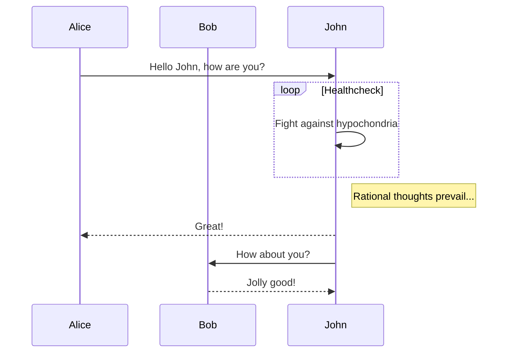
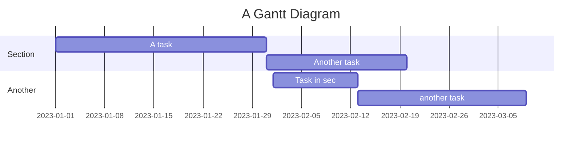
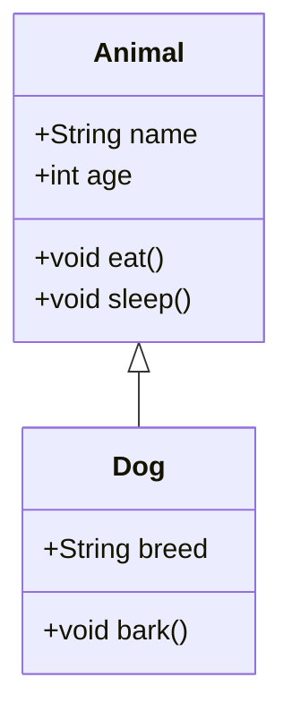
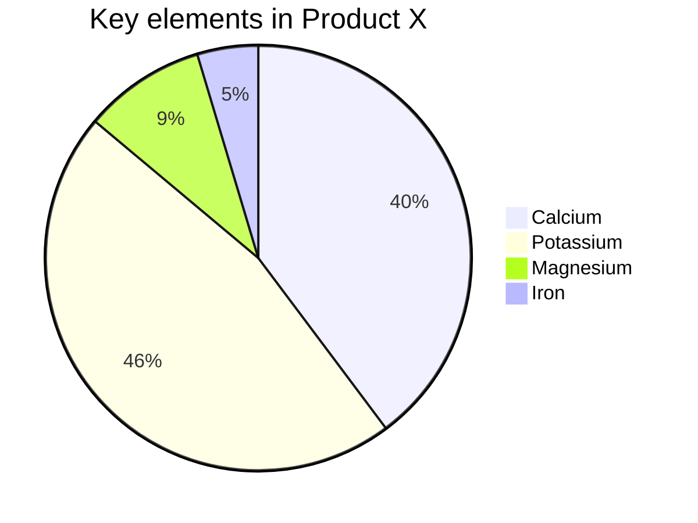
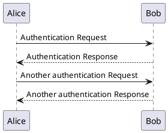

# Mermaid Examples

Mermaid is a JavaScript-based diagramming and charting tool that renders Markdown-inspired text definitions to create and modify diagrams dynamically.

## Flowchart


## Sequence Diagram



## Gantt Chart



## Class Diagram



## Pie Chart




---
## PlantUML

PlantUML is another tool for creating diagrams from plain text descriptions. It supports various types of diagrams, including sequence diagrams, use case diagrams, class diagrams, and more.

### Example Sequence Diagram



## Markdown Tables

Markdown tables are useful for organizing and presenting data in a tabular format.

### Example Table

```markdown
| Feature       | Description                        |
|---------------|------------------------------------|
| **Syntax**    | Easy to learn and use              |
| **Flexibility**| Can be used for various purposes  |
| **Compatibility** | Works with many tools and platforms |
```

## Task Lists

Task lists are useful for tracking progress on tasks and creating to-do lists.

### Example Task List

```markdown
- [x] Write documentation
- [ ] Implement feature X
- [ ] Review pull requests
- [ ] Deploy to production
```

## Code Blocks

Code blocks are essential for including code snippets in your documentation.

### Example Code Block

<pre>
```python
def hello_world():
	print("Hello, world!")
```
</pre>

## Diagrams.net (formerly Draw.io)

Diagrams.net is a powerful tool for creating complex diagrams and flowcharts. You can embed diagrams created with Diagrams.net in your markdown files.

### Example Diagram

You can embed a diagram by including an image link to the diagram file:

```markdown

```

## Pseudocode

Pseudocode is a way to describe algorithms in a language-agnostic manner. You can include pseudocode in your markdown files using code blocks.

### Example Pseudocode

<pre>
```
BEGIN
	READ number
	IF number > 0 THEN
		PRINT "Positive"
	ELSE
		PRINT "Non-positive"
	ENDIF
END
```
</pre>

## Roadmap

A roadmap is useful for planning and visualizing the progress of a project.

### Example Roadmap

```markdown
## Project Roadmap

- **Q1 2023**
  - [x] Initial project setup
  - [x] Implement core features
  - [ ] User testing

- **Q2 2023**
  - [ ] Feature enhancements
  - [ ] Performance improvements
  - [ ] Beta release
```

## Backlog

A backlog is a list of tasks or features that need to be completed.

### Example Backlog

```markdown
## Backlog

- Feature A
- Feature B
- Bug fix 1
- Bug fix 2
```