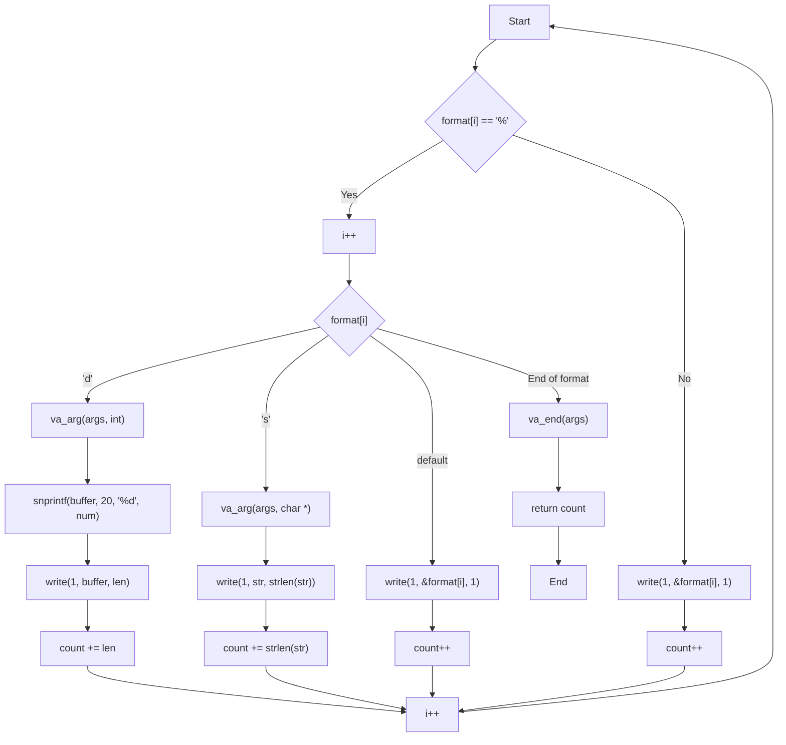

# Roadmap for Developing the `ft_printf.c` Function

	This roadmap outlines the steps involved in developing the `ft_printf.c` function, as described in the provided project document.
	
### 1. Requirements
**References**
- [Subject](https://github.com/diegonmarcos/L-ecole-42/blob/main/1.Projects/C1_ft_printf/1.Roadmap/en.subject.pdf)

#### a) Mandatory

- Must recode `printf()` function from libc.
- Prototype must be `int ft_printf(const char *, ...);`.
- Don't implement buffer management of the original printf().
- Handle the following conversions: `cspdiuxX%`.
- Must be compared against the original `printf()`.
- Use the command `ar` to create the library.
- `libftprintf.a` has to be created at the root of the repository.
- Implement the conversions as described for `c`, `s`, `p`, `d`, `i`, `u`, `x`, `X`, and `%`.

#### b) Forbidden Functions and Limitations**
**b1) Limitations**

**b2) Norminette**
```
- No for, do...while, switch, case, goto, ternary operators, or variable-length arrays allowed;
- A function can take 4 named parameters maximum;
- Each function must be a maximum of 25 lines;
- You can't declare more than 5 variables per function;
- Each line must be at most 80 columns wide;
- No assigns and declarations in the same line (unless static); and more...
```
* [42 Norms](https://github.com/42School/norminette/blob/master/pdf/en.norm.pdf) - Information about 42 code norms. `PDF`
* [Norminette](https://github.com/42School/norminette) - code norm inspector, made by 42. `GitHub`
* [42 Header](https://github.com/42Paris/42header) - 42 header for Vim. `GitHub`


#### **c) Edge Cases and Error Handling**

- **Invalid format specifiers:** Handle cases where the format string contains invalid or unsupported specifiers.
- **Null pointers:** Handle cases where a `%s` specifier corresponds to a null pointer.
- **Incorrect number of arguments:** Handle mismatches between the number of format specifiers and the number of provided arguments.
- **Minimum field width:** Handle the `%5d` like format specifier, printing an integer with a minimum width of 5 characters.
- **Precision:** Handle the `%.2f` like format specifier, printing a floating-point number with 2 decimal places.
- **Flags:** Handle the flags `-`, `0`, and `.` in any combination.
- **Space flag:** Handle the space flag for padding.
- **`#` flag:** Handle the `#` flag for alternative conversion formats (e.g., `0x` prefix for hexadecimal).
- **`+` flag:** Handle the `+` flag for displaying a sign.

**d) Bonus**
- Manage any combination of the following flags: ’-0.’ and the field minimum width  
under all conversions
- Manage all the following flags: ’# +’ (Yes, one of them is a space 

>_If you plan to complete the bonus part, think about the  
implementation of your extra features from the start. This way,  
you will avoid the pitfalls of a naive approach_


### 2. Sources and Resources
#### a. Sources
- [Func Variaticas](https://trucosinformaticos.wordpress.com/2018/11/25/funciones-variadicas/)
- [Variadic Arh](https://en.cppreference.com/w/c/variadic)
- [Variadic Func](https://en.cppreference.com/w/c/language/variadic)
#### b. Resources
#### c. Take Away
### 3. Designing the Solution
#### a. User Stories 
#### b. Pseudocode PDL
Write the Pseudocode here:

``` c
function ft_printf(format, ...args):
  initialize count to 0
  for each character in format:
    if character is '%':
      get the next character (specifier)
      if specifier is 'd_ecimal':
//        get an integer from args
		  f`convert_integer_to_string()
//        write string to output
//        update count
      else if specifier is 's_tring':
//        get a string from args
//        write string to output
//        update count
      // Add more cases for other specifiers as needed
      else:
        write the specifier character to output
        update count
    else:
      write the character to output
      update count
  return count
```


#### c. Simplified Limited Implementation 
>`without: width, precision, flags, lacks error handling, other formatting options, edge cases and platform-specific details. `

> High level functions list creation for milestones and team allocation 

---


``` C
#include <stdio.h>
#include <string.h>
#include <stdarg.h>
#include <unistd.h>

int ft_printf(const char *format, ...) {
  va_list args;
  va_start(args, format);

  int count = 0;
  for (int i = 0; format[i]; i++) {
    if (format[i] == '%') {
      i++;
      switch (format[i]) {
        case 'd':;{
          int num = va_arg(args, int);
          char buffer[20]; // Assuming int won't exceed 20 digits
          int len = snprintf(buffer, 20, "%d", num);
          write(1, buffer, len);
          count += len;
          break;
        }
        case 's':;{
          char *str = va_arg(args, char *);
          write(1, str, strlen(str));
          count += strlen(str);
          break;
        }
        // Add more cases for other format specifiers like 'c', 'f', 'x', etc.
        default:
          write(1, &format[i], 1);
          count++;
      }
    } else {
      write(1, &format[i], 1);
      count++;
    }
  }

  va_end(args);
  return count;
}

int main(void) 
{
  char str[] = "Moulinette";
  int age = 42;
  ft_printf("Hello, %s! You are %d years old.\n", str, age);
  return 0;
}
```


#### d. Flowchart Hgh Level


    
#### d. FlowChart High Level
![[Screenshot from 2024-11-29 15-49-50.png]]
#### e. Flow Chart Low Level


### 4. Unit Tester
#### a. Inputs vs Expected Outputs
### 5. Documentation
#### a. Functions Manual

- **Variadic Functions:**
    - `va_start(ap, last)`: Initializes a `va_list` for accessing variable arguments.
    - `va_arg(ap, type)`: Retrieves the next argument of a specified type.
    - `va_end(ap)`: Cleans up the `va_list` when finished.
- **Format Specifiers:**
    - `%c`, `%s`, `%d`, `%i`, `%u`, `%x`, `%X`, `%p`, `%%`, etc.: Used to format different types of data (characters, strings, integers, unsigned integers, hexadecimal numbers, pointers, etc.).
- **String Manipulation:**
    - `ft_strlen`, `ft_strchr`, `ft_memcpy`, etc.: Functions from `libft` for working with strings.
- **Integer to String Conversion:**
    - Custom functions to convert integers to strings (e.g., `ft_itoa` or equivalent in `libft`).


#### b. Flowcharts 
#### c. UB implementations
### 6. Backlog/Milestones & Submissions
#### a. Backlog

##### Low Level Functions
- [x] **Variadic Functions:**
    - [x] `va_start(ap, last)`: Initializes a `va_list` for accessing variable arguments;
    - [x] `va_arg(ap, type)`: Retrieves the next argument of a specified type;
    - [x] `va_end(ap)`: Cleans up the `va_list` when finished.
- [x] **String Manipulation:**
    - [x] `ft_strlen`; 
    - [x] `ft_strchr`; 
    - [x] `ft_memcpy`;
- [x] **Integer to String Conversion:**
    - [x] `ft_itoa` ;
##### High Level Functions
- [ ] Format specifiers I/O:
	- [ ] `%c` - Print a single character;
	- [ ] `%s` - Print a string;
	- [ ] `%p` - Print void * pointer argument in hexadecimal format;
	- [ ] `%d` - Print a decimal (base 10) number;
	- [ ] `%i` - Print an integer in base 10;
	- [ ] `%u` - Prints an unsigned decimal (base 10) number;
	- [ ] `%x` - Print a number in hexadecimal (base 16) lowercase format;
	- [ ] `%X` - Print a number in hexadecimal (base 16) uppercase format;
	- [ ] `%%` - Print a percentage sign;
##### Makefile rules
- Make Rules
	- [x] `make` - Compile ft_printf files.
	- [x] `make clean` - Delete all .o (object files) files.
	- [x] `make fclean` - Delete all .o (object files) and .a (executable) files.
	- [x] `make re` - Use rules `fclean` + `all`.

#### b) Milestones

#### c) Submission
* Submit the completed code to the assigned Git repository. [cite: 20]
* Double-check file names for correctness. [cite: 57]